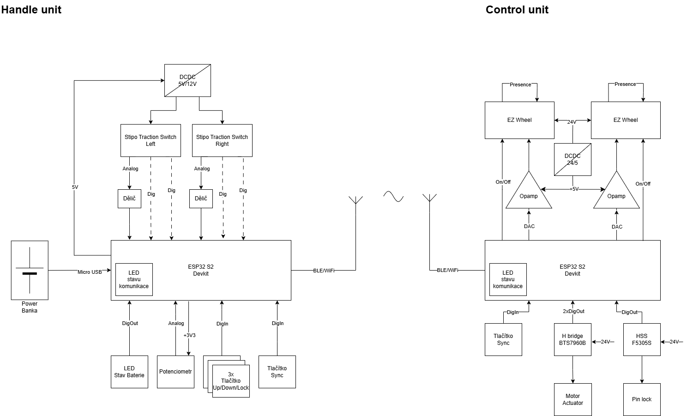

# _Control unit_

This project constains the code for the _Control unit_

* ESP-IDF - version v5.4.1
* Chip - ESP32S2

## State of development

List of things that need to be implemented or has been implemanted

- [ ] Core initalization
- [ ] Configuring GPIO pins
- [ ] Configuring DAC pins
- [ ] Setup of BLE
- [ ] Comunication protocol with _Handle Unit_
- [ ] Control logic
- [ ] Logging 

## How to build
The first step needed for bulding this exaple is to instal **esp-idf**, which serve both as toolchain and build tool for any ESP32 related projects. There are multiple ways how to install **esp-idf**, but I would recomend the VS Code extension. All the other ways and guide how to install all can be found [here](https://docs.espressif.com/projects/esp-idf/en/stable/esp32s2/get-started/index.html#installation). After that is setuped just run `idf.py build` in root folder (where this README is located).
## Functionality

This unit mostly serves as an receiver of data from _Handle Unit_. 

The rough schematics can be seen on the following image.

